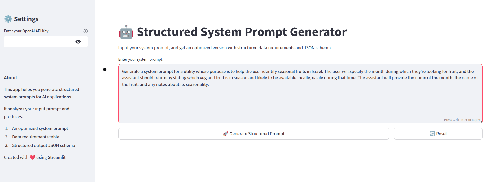
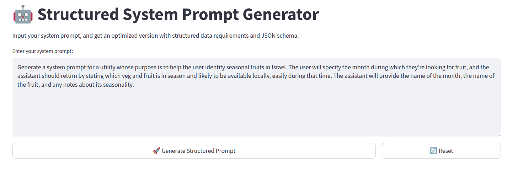
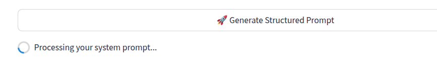
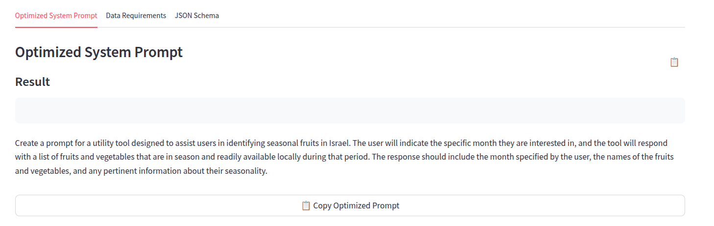
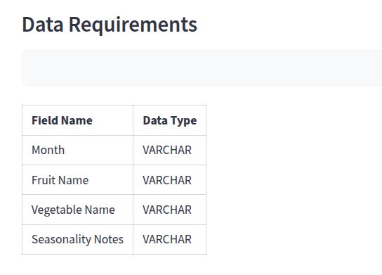
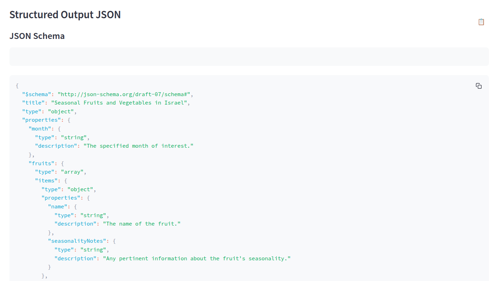

# Structured System Prompt Generator

[](https://structuredprompts.streamlit.app/)

A Streamlit application that helps you generate structured system prompts for AI applications. This tool analyzes your input prompt and produces three key outputs:

1. **Optimized System Prompt:** A refined version of your system prompt with improved clarity and flow
2. **Data Requirements:** A table listing all data fields required by the system prompt
3. **Structured Output JSON:** A JSON schema that aligns with the data requirements



## Features

- Input your system prompt via text
- Generate an optimized system prompt with improved clarity
- Identify all data requirements in a structured table
- Create a JSON schema for structured outputs
- Copy results to clipboard with one click
- Clean, modern UI with responsive design

## How It Works

The application uses OpenAI's GPT-4 model to analyze your system prompt and generate structured outputs:

1. **Input your system prompt**
   

2. **Get an optimized version** with improved clarity and structure
   

3. **View data requirements** in a structured table format
   

4. **Obtain a JSON schema** for structured data collection
   

5. **Copy any output** to clipboard with a single click
   

## Installation

1. Clone this repository:
   ```bash
   git clone https://github.com/yourusername/Structured-System-Prompt-Generator.git
   cd Structured-System-Prompt-Generator
   ```

2. Install the required dependencies:
   ```bash
   pip install -r requirements.txt
   ```

## Usage

1. Run the Streamlit app:
   ```bash
   streamlit run app.py
   ```

2. Open your web browser and navigate to the URL displayed in the terminal (typically http://localhost:8501)

3. Enter your OpenAI API key in the sidebar

4. Input your system prompt in the text area

5. Click "Generate Structured Prompt" to process your input

6. View and copy the results:
   - Optimized System Prompt
   - Data Requirements Table
   - Structured Output JSON

7. Use the "Reset" button to clear all inputs and outputs

## Requirements

- Python 3.7+
- Streamlit 1.32.0+
- OpenAI API key
- OpenAI Python library 1.12.0+

## Use Cases

- **AI Development Teams**: Create consistent system prompts for AI applications
- **Product Managers**: Define data requirements for AI-powered features
- **UX Designers**: Understand data structures needed for AI interactions
- **Developers**: Generate JSON schemas for API endpoints that interface with AI systems

 
 